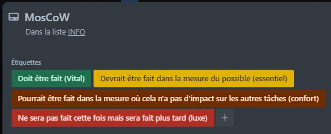
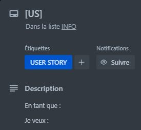
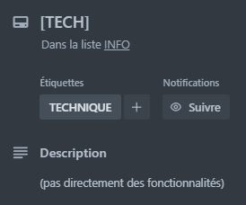
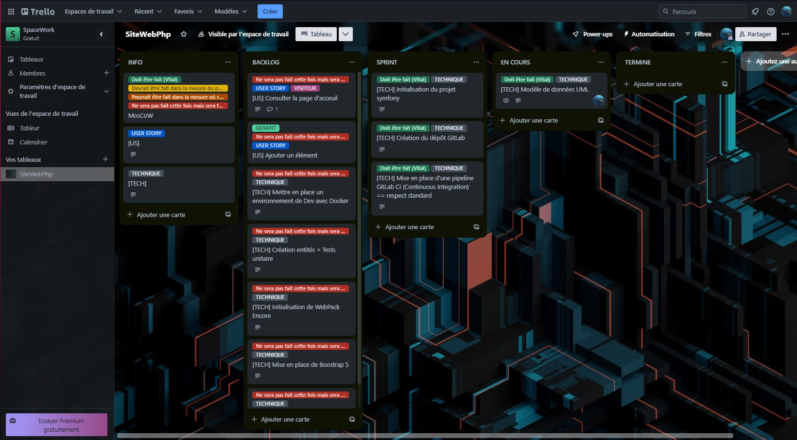
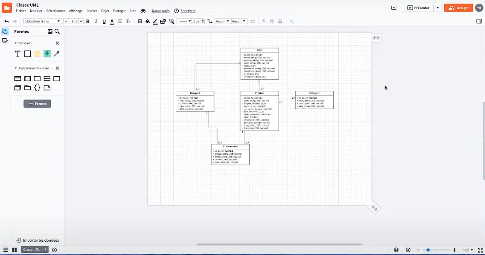
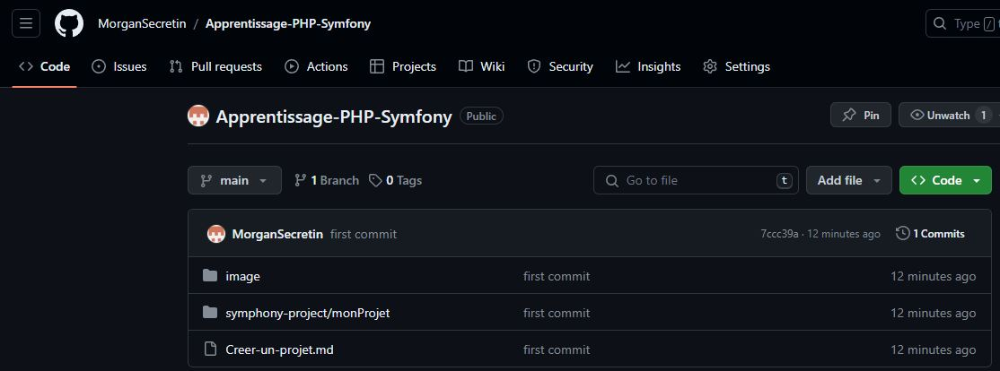

# Procedure de creation d'un projet

## Outils :
- Trello
- LucidChart

---
# 1. Trello

##  Listes
### A. "INFO" == Bloc note :
- ### Cartes modèles
- Carte MosCoW == méthode priorisation de tache
- 
- Carte USER STORY == "En tant que : ..." + "Je veux : ..."
- 
- Carte TECHNIQUE == Back
- 
<br><br>

### B. liste "BACKLOG" == liste fonctionnalité / tache technique / tache administrative :
<br>

### C. liste "SPRINT" == Scrum (ce qu'on fait durant la période) :
- Attribution aux développeurs de une ou de plusieurs cartes
<br><br>

### C. liste "EN COURS" == Tache sur le moment :
<br><br>

### D. liste "TERMINE" == tache finie :
- ### Cartes modèles



<br></br>
<br>

---
# 2. UML avec LucidChart ou Paradigme
- Ecrire les différents objets qui semble nécéssaires.
- Relier ces objets entre eux.
- Evolue dans le temps avec le projet.
- 

<br></br>
<br>

---
# 3. Creation projet symfony
- commande : 
```shell
symfony new monProjet --webapp
```
- symfony = framework Php
- --webapp = version plus complete pour un projet web

<br></br>
<br>

---
# 4. Ajout du readme.md
- Decrit le projet
- Permet à un nouveau développeur de comprendre le projet
- Evolue dans le temps avec le projet.
- 

<br></br>
<br>

---
# 4. Création d'un dépot Github/Gitlab
- Créé nouveau projet
- Suivre initialisation repository
- Utilisation d'une clé ssh si problème d'autorisation :
- - Création possible d'une clé publique avec GIT GUI
- - Copie de cette clé dans les parametres Github/Gitlab 
- 